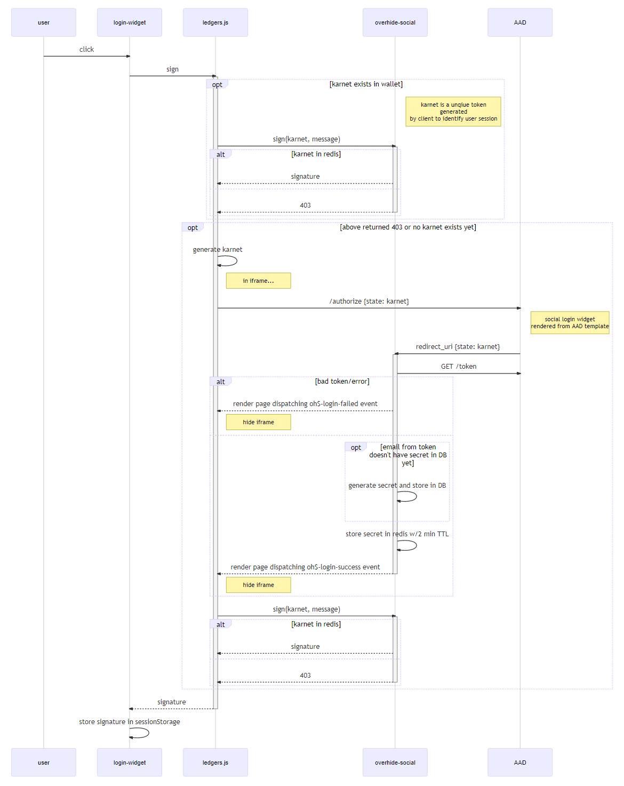

<p align="center"><a href="https://github.com/overhide"></a></p>

<p align="center"><a href="https://overhide.io">overhide.io</a></p><p style="width: 500px; margin: auto">A free and open-sourced ecosystem of widgets, a front-end library, and back-end services &mdash; to make addition of "logins" and "in-app-purchases" (IAP) to your app as banal as possible.</p>

<hr/>

# overhide-social

[](https://circleci.com/gh/overhide/overhide-social)

API that keeps *overhide-ledger* signing keys behind a social login.

Supported social logins:

- Google
- Microsoft

This service is configured with [Microsoft AAD B2C](https://docs.microsoft.com/en-ca/azure/active-directory-b2c/authorization-code-flow).

The gist of this flow as it relates to [ledgers.js](https://www.npmjs.com/package/ledgers.js) is:


*Figure 1: Shows the gist of this flow.*

# Quick Start Docker

1. `npm install`
1. create a valid `.npmrc.dev` (from `.npmrc.sample` template)
1. `npm run compose-dev`
1. jump to "First Time DB Setup" section for the first-time DB setup
1. jump to "Database Evolutions" section, especially the "For Docker" subsection
1. your *oh-social* container failed since your DB wasn't setup--now it is--find your *oh-social* container name: `docker ps -a`; look for *oh-social* with an "Exited" status.
1. start it again: `docker start <container name>`
1. do a `docker logs <container name>` to make sure it's up
1. browse to http://localhost:8120/swagger.html

# Quick Start Non-Docker

1. `npm install`
1. jump to "First Time DB Setup" section for the first-time DB setup
1. `npm run start`

# Configuration

See [.npmrc.sample](.npmrc.sample).

Some call-outs:

*AUTH_TOKEN_URL* JSON mapping provider-keys (e.g. 'microsoft', 'google') to token endpoint URLs; allowin retrieval of tokens from an *authorization code* for Microsoft social-login (e.g. from AAD B2C)
*AUTH_CLIENT_ID* is the client ID (e.g. from AAD B2C)
*AUTH_CLIENT_SECRET* is the client secret (e.g. from AAD B2C)
*AUTH_REDIRECT_URI* is this service's redirect URI (e.g. as setup with AAD B2C)
*KEYV_URI* is the URI of the [keyv](https://www.npmjs.com/package/keyv) TTL cache
*KEYV_KARNETS_NAMESPACE* is the namespace for karnets (client tokens)
*KEYV_KARNETS_TTL_MILLIS* is how long a karnet (client token) will remain cached and therefore usable to sign a message

# First Time DB Setup

All the DB connectivity configuration points assume that the DB and DB user are setup.

For localhost Docker, `psql` into the container:

```
npm run psql-dev
\c "oh-social"
\dt
```


The 'adam' role and 'oh-social' DB should already be created and connected to with the above command (as per `.npmrc.dev` environment passed into docker-compose).

If not, to manually create:

```
postgres=# create database "oh-social";
postgres=# create user adam with encrypted password 'c0c0nut';
postgres=# grant all privileges on database "oh-social" to adam;
```

Make sure to set the configuration points in your *.npmrc* appropriately.

Now you're ready to run database evolutions on the new database.

# Database Evolutions

There is a single Node file to check for and perform database evolutions.

Run it from the application node with `npm run db-evolve`.

It will evolve the database to whatever it needs to be for the particular application version.

The *main/js/lib/database.js* has an *init(..)* method which should check that the database is at the right evolution for that version of the app.

Consider currently running nodes before evolving: will they be able to run with the evolved DB?  Perhaps stop them all before evolving.

## Check

To check the database pre/post evolution (first time DB setup already done):

- log into DB
- list tables

```
npm run psql-dev
\dt oh-social.*
```

If you need to select role and DB:

```
set role oh-social;
\c oh-social;
```

More commands:  https://gist.github.com/apolloclark/ea5466d5929e63043dcf

## Evolve

If running using Docker, jump into a container to run the evolution:

`docker run -it --rm --link postgres:postgres --network oh_default oh-social /bin/sh`

Then run the evolution:

`npm run db-evolve`

# Rate Limiting

Access to these APIs is gated via config points:

- `RATE_LIMIT_MAX_REQUESTS_PER_WINDOW`
- `RATE_LIMIT_WINDOW_MS`

This only applies to requests with a token other than the `INTERNAL_TOKEN` (if set).  `INTERNAL_TOKEN` requests are not rate-limited.

All rate-limits are shared across nodes sharing the same `RATE_LIMIT_REDIS_NAMESPACE` if `RATE_LIMIT_REDIS_URI` is set to a redis instance.

